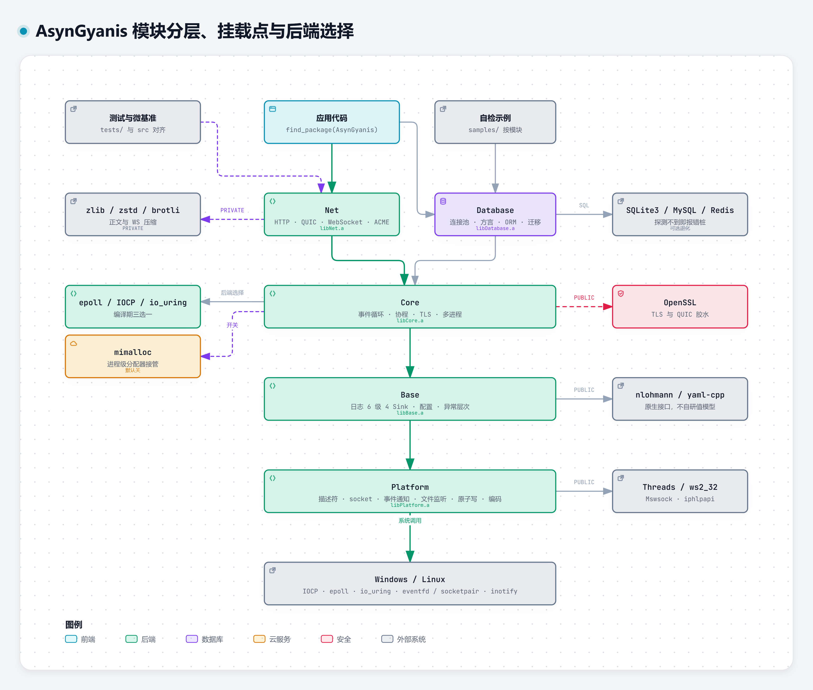
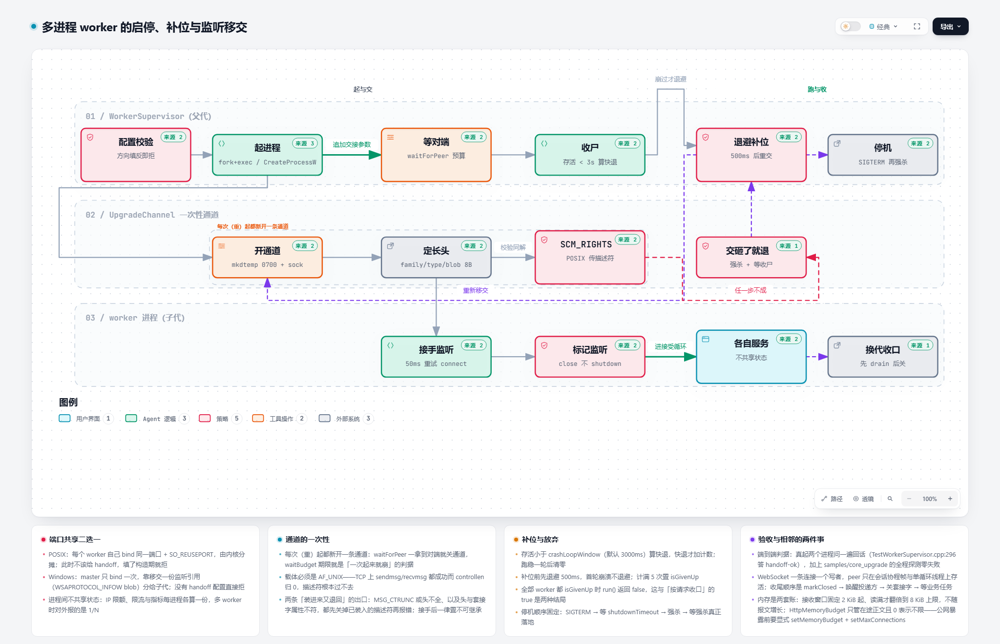
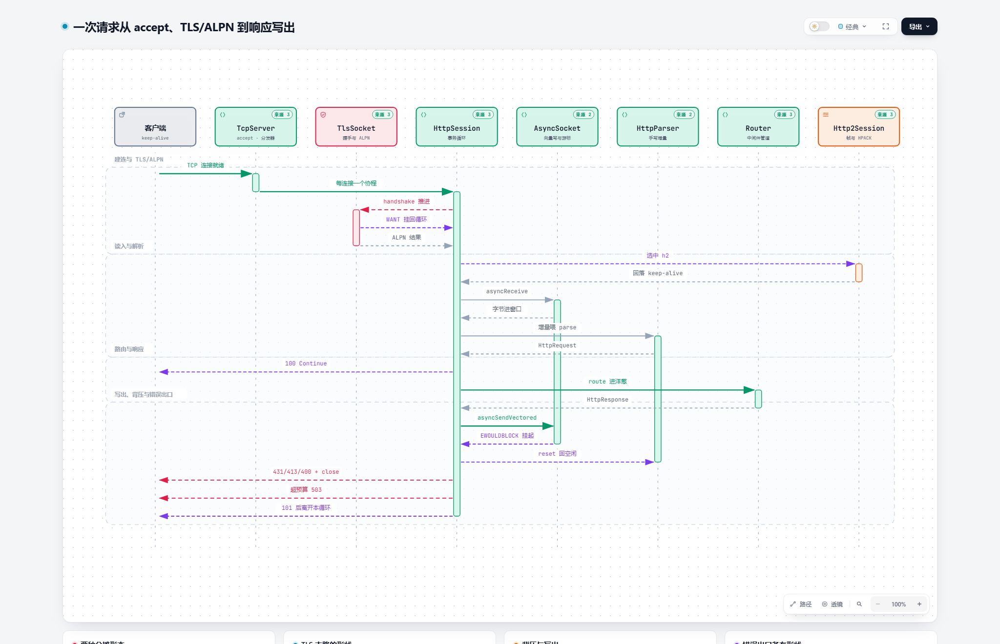
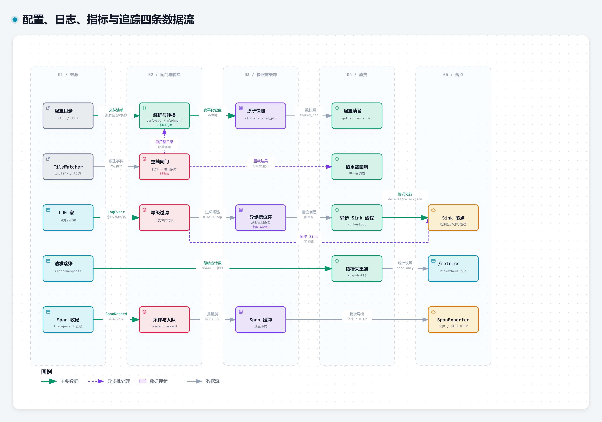
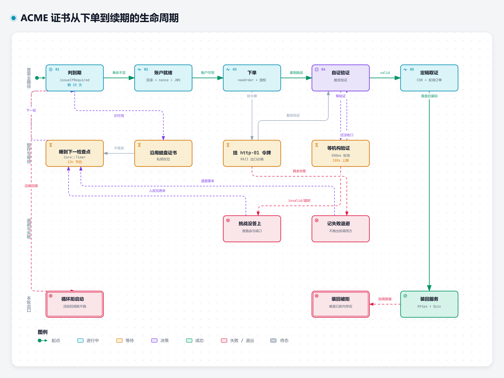
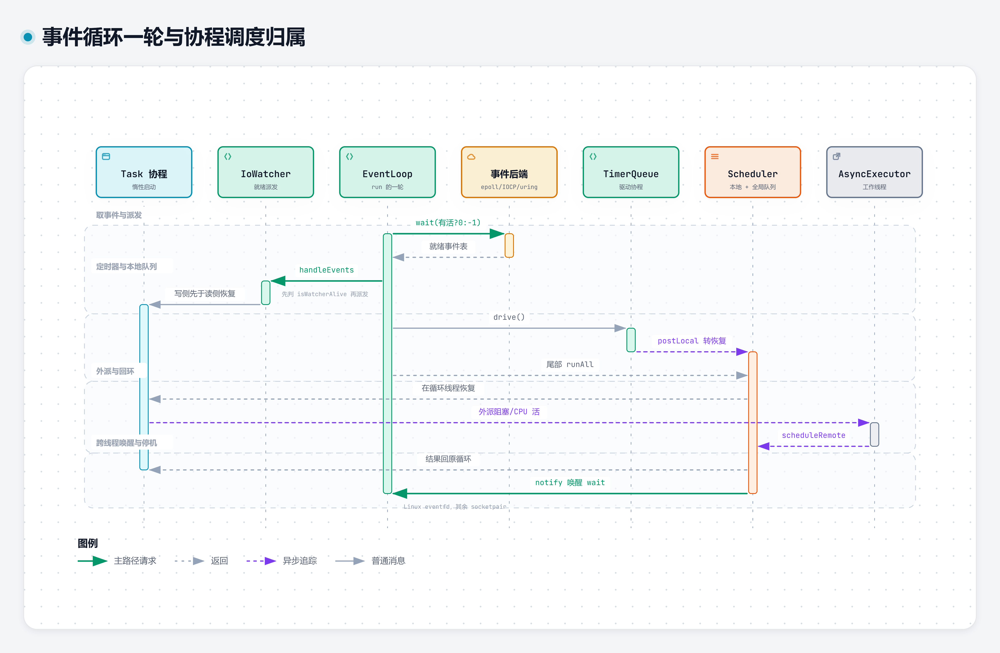
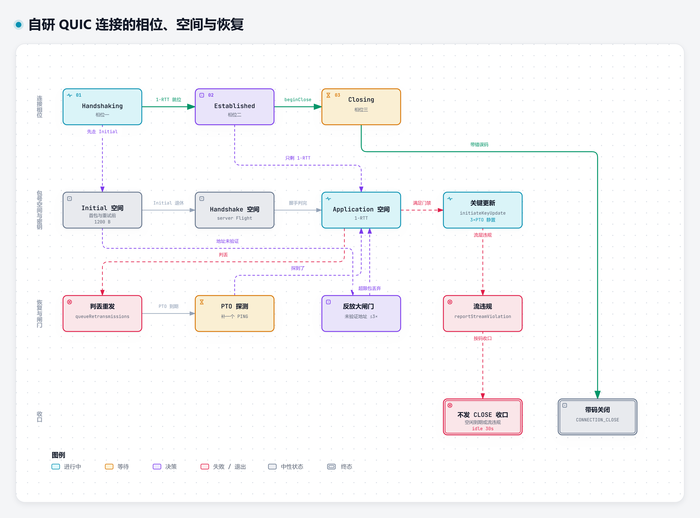
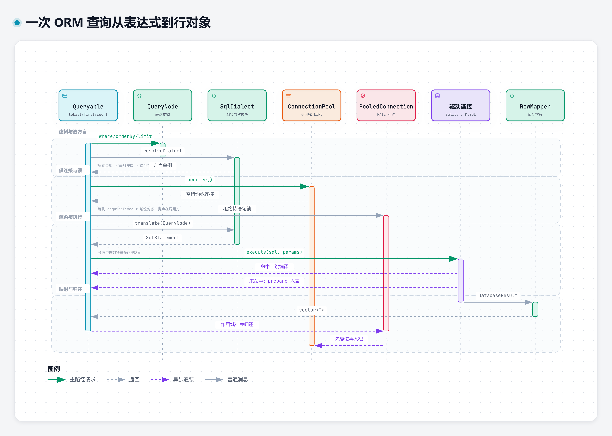
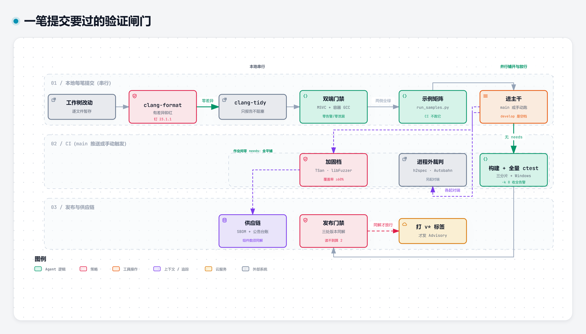

# AsynGyanis

> 基于 C++23 协程与水平触发事件循环（Linux epoll / Windows 完成端口 / 可选 io_uring）的跨平台异步服务器引擎 —— 网络（TCP / HTTP/1.1 / HTTP/2 / HTTP/3 / WebSocket / QUIC）、数据库（ORM / 连接池 / 三方驱动）与原生格式库（nlohmann_json / yaml-cpp）

[](https://en.cppreference.com/w/cpp/23)
[](https://kernel.org)
[](https://microsoft.com/windows)
[](https://github.com/Gyanis9/AsynGyanis/actions/workflows/linux-ci.yml)
[](https://github.com/Gyanis9/AsynGyanis/actions/workflows/windows-ci.yml)

## 特性

**运行时（Core）**

- **三后端统一事件循环** — Linux epoll、Windows 完成端口（IOCP，完成通知翻译成 epoll 事件位）、Linux 可选 io_uring（`ASYN_WITH_IO_URING`）；语义一律水平触发 + 按需摘除关注位
- **C++20 协程** — `Task<T>` 惰性启动，`co_await` 挂起与恢复；等待描述符就绪、定时到期、跨线程投递都是可等待对象
- **每线程一个事件循环** — `IoContext` 持有 `ThreadPool`，每个工作线程绑定独立的 `EventLoop`
- **两级就绪队列调度** — `Scheduler` 本地队列 + 全局队列，跨线程投递按归属循环投递
- **协作式取消与优雅启停** — `std::stop_token` 贯穿，`stop()` 后各线程收敛退出
- **多进程 worker** — `WorkerSupervisor` 拉起 N 个 worker 同端口服务、崩溃即补位；进程间不共享状态。
  分摊形状按平台分叉：POSIX 上每个 worker 自己 bind 同一端口（`SO_REUSEPORT`），Windows 上没有那个
  选项、多个进程各自绑只会让最后绑上的一个收到全部报文，于是改由 master bind 一次、把套接字逐个复制
  给 worker。数据报这一侧的接手入口是 `UdpServer` 与 `QuicServer` 的接手构造（外加不带地址的
  `listen()`），交回来的裸描述符由 `Platform::DatagramSocket::adopt` 包成本层持有者语义；两种启动顺序
  不许混用——接手来的服务端再去 bind 会把交过来的那份静默闲置，端口上看着在监听却收不到报文
- **TLS** — 基于 OpenSSL 的非阻塞 `SSL_read` / `SSL_write` 与事件循环集成
- **进程级指标注册表** — `ProcessMetricsRegistry::registerMetric(...)` 交回 RAII 把手（析构即注销），
  `/metrics` 末尾按登记的**完整名字**原样导出；库内非 HTTP 的通道（ACME、TLS 握手、worker 崩溃，
  以及 Net 的 UDP、Database 的连接池）在对象构造时各自登记，应用不需要接线
- **自研内存与缓冲** — 协程帧内存池（`CoroutinePool`，重载 `operator new` 接入 `Task`）；可选 mimalloc 接管全局分配（`ASYN_WITH_MIMALLOC`）

**网络（Net）**

- **HTTP/1.1** — 手写增量解析器（含资源上限与分块编码）、Keep-Alive 持久连接
- **HTTPS** — TLS 握手 + ALPN 协商（h2 / http/1.1）、mTLS、证书热轮换
- **HTTP/2** — RFC 9113 帧与连接状态机、自研 HPACK（含 Huffman）、接收窗口流控、流式响应、GOAWAY；h2c 明文与 RFC 8441 扩展 CONNECT 隧道
- **出站 HTTP 客户端** — `HttpClient` 带按主机归组的 Keep-Alive 连接池，TLS 侧 ALPN 通告 `h2,http/1.1`；
  协商到 h2 时多条请求并发复用同一条连接（头块按最大帧负载切片、按流发送窗口、见顶前主动换连接），
  已经写上通路而没等到答完的请求**不重发**（非幂等请求做两遍比失败更坏）；`send()` 接受任意方法与
  附加头部，失败交回一句点明断在哪一段的中文原因（`std::expected`）
- **HTTP/3 + QUIC** — 自研 QUIC 传输层（RFC 9000/9001：握手、流与流量控制、丢包恢复与 NewReno 拥塞控制、1-RTT 密钥更新）+ 自研 HTTP/3 会话（帧层、QPACK 含动态表、流式正文、GOAWAY 优雅排空、RFC 9220 隧道）；同一个端口号的 UDP 上提供 h3
- **WebSocket** — RFC 6455 握手与帧编解码、UTF-8 校验、分片重组、有界收帧队列、permessage-deflate（RFC 7692）；h1 升级与 h2/h3 隧道共用协商
- **路由与中间件** — 精确匹配、参数化路径（`:id`）、通配符（`*`）、洋葱模型
- **观测与限额** — `/metrics`（Prometheus 文本 0.0.4）、`/healthz` 与 `/debug/loops`（进程内每条事件循环一行的 JSON，看哪条被处理器占住）内建端点、状态码与延迟直方图统计、令牌桶限流、按来源 IP 并发限额
- **响应压缩** — gzip / zstd / br 协商（含 WebSocket 的 permessage-deflate）
- **按线程一个监听 socket** — `SO_REUSEPORT` 由内核分摊连接，避免 accept 单点
- **接受分发（跨平台多核扩展）** — 一个监听器接受、按轮转把连接交给 N 个工作循环，不依赖
  `SO_REUSEPORT`；Windows 上这是唯一可用的多核形态（`ConnectionDistributor` + `TcpServer::startAccepting()`）
- **静态文件服务** — `staticFileDir()` 一行接入
- **证书自动化（ACME / RFC 8555）** — `AcmeCertificateManager` 走完目录、账户、下单、自证、定稿与
  取证这一整台状态机：私钥与证书原子落盘（私钥 0600），到期前自主续，签好后经回调装回服务；
  协议层（`AcmeClient`）与密钥层（`AcmeKeyPair`：JWK、RFC 7638 指纹、JWS、CSR）都能单独用。
  h3 那一侧由 `QuicServer::reloadCertificate()` 承接同一个轮换动作，443/TCP 与同一端口的 UDP 不会一张新一张旧。
  自证支持 HTTP-01 与 DNS-01（RFC 8738）两种，一次签发只走一条：默认 HTTP-01，构造时交来 `AcmeDns01TxtWriter`
  就改走 DNS-01——后者**不需要任何入站通路**，被备案拦截或 80 端口不可达的部署也能自动续期，且这是通配域名
  （`*.example.com`）唯一可行的自证方式。TXT 写入动作交给你接的那家 DNS，仓库内自带阿里云云解析的实现。
  tls-alpn-01 仍不做：机构只给那一种时当场判失败并说明要哪一种，不会挑一条答不了的挑战去 POST

**数据（Database）**

- **SqlSugar 风格 ORM** — 结构体声明即表结构，`insert` / `toList` / `first` / `count` / `update` / 删除 / 批量插入
- **SQL 方言层** — 查询树渲染与参数收集只有一份实现（`StandardSqlDialect`），SQLite 与 MySQL 各自只覆写引擎知识；写语句与事务语句一律由方言生成，ORM 不含 SQL 拼接
- **参数化执行** — 取值一律以绑定参数送出，不拼进 SQL 文本（含引号、`--`、分号的文本只会被当作数据）
- **高性能连接池** — LIFO 复用、惰性创建、双机制清理（空闲回收 + 上限保护）
- **异步执行器** — 数据库阻塞调用挪出事件循环线程，完成后经 `Scheduler::scheduleRemote` 投回指定 `EventLoop`
- **事务与建表迁移** — `Transaction` RAII（析构未提交自动回滚）、`SchemaMigrator` 从表结构生成 DDL

**基础（Platform / Base）**

- **原生格式库** — JSON 与 YAML 直接使用 [nlohmann_json](https://github.com/nlohmann/json) 与 [yaml-cpp](https://github.com/jbeder/yaml-cpp) 的接口（DOM、Pointer/Patch、多文档、事件），不再自研解析与值模型
- **配置管理** — YAML/JSON 加载、目录递归装载、热重载（inotify / ReadDirectoryChangesW）
- **结构化日志** — 6 级、4 种 Sink（控制台/文件/滚动/异步）、C++20 `std::format`、源码位置
- **平台隔离** — 所有 OS 调用集中在 `Platform`，上层不出现平台宏与 Win32/POSIX API

## 架构

模块分层与依赖方向（箭头表示「依赖」；依赖可见性 PUBLIC/PRIVATE 与可选开关都标在边上）：



> 下面这张是总览，其余八张按主题拆开画在各小节里；点链接看交互版。 交互版（缩放 / 聚焦 / 连线追踪 / 深浅色）：[layered-architecture.html](assets/diagrams/layered-architecture.html)

| 模块 | 库 | 职责 |
|------|----|------|
| `Platform` | `libPlatform.a` | 描述符 / socket / 事件通知 / 定时器 / 文件监听 / 原子写 / 编码转换 / 进程与时间 |
| `Base` | `libBase.a` | 日志、配置、异常层次、JSON/YAML 原生库的传递依赖 |
| `Core` | `libCore.a` | 事件循环、协程运行时、socket、TLS、多进程编排 |
| `Net` | `libNet.a` | TCP 服务基类、HTTP/1.1/2/3、WebSocket、QUIC、路由与中间件、ACME |
| `Database` | `libDatabase.a` | 连接抽象、连接池、SQL 方言、ORM、建表迁移 |

### 图解索引

| 图 | 类型 | 讲什么 |
|----|------|--------|
| [模块分层与后端选择](assets/diagrams/layered-architecture.html) | 架构 | 五层依赖方向、第三方挂载点、epoll/IOCP/io_uring 三选一、两个默认关的开关 |
| [一次请求的调用链](assets/diagrams/http-request-sequence.html) | 时序 | accept → TLS/ALPN 分岔 → 增量解析 → 路由与中间件 → 向量写与背压 → 五种错误出口 |
| [事件循环一轮](assets/diagrams/runtime-kernel-sequence.html) | 时序 | 九步循环、三后端在第 5 步的分岔、协程与线程的归属契约 |
| [配置/日志/指标/追踪](assets/diagrams/config-log-dataflow.html) | 数据流 | 四条数据面各自的闸门、快照与缓冲、落点 |
| [QUIC 连接生命周期](assets/diagrams/quic-connection-lifecycle.html) | 状态机 | 三相位与三包号空间、NewReno 恢复、反放大与常量、没实现的能力 |
| [ACME 证书生命周期](assets/diagrams/acme-certificate-lifecycle.html) | 状态机 | 下单到装回、12h 节拍与 30 天阈值、九种失败与三档处置 |
| [ORM 查询链](assets/diagrams/orm-query-sequence.html) | 时序 | 表达式树 → 方言渲染 → 租约与语句锁 → 缓存两分支 → 行映射 |
| [多进程移交与换代](assets/diagrams/worker-handoff-workflow.html) | 流程 | 启停补位、AF_UNIX 描述符移交、监听收口禁 shutdown、换代 drain |
| [验证闸门](assets/diagrams/verification-gate-workflow.html) | 流程 | 本地串行四道 → CI 十条并行 → 发布与供应链，以及哪些只是 SKIP |

模块内的子目录（如 `Base/Log/Sinks`、`Core/EventLoop`）**不引入新的命名空间**：命名空间一律到模块名为止（`AsynGyanis::Base`、`AsynGyanis::Core` …），include 路径从 `src/` 起算（`#include "Core/EventLoop/EventLoop.h"`）。

## 快速开始

### 前置依赖

- **CMake** ≥ 3.20、**Conan** ≥ 2.0（依赖与打包只走 Conan 这一条路线）
- **编译器**：MSVC ≥ 19.40 / GCC ≥ 13 / Clang ≥ 17（需支持 C++23 标准）
- **系统**：Windows ≥ 10 或 Linux（事件后端：Linux epoll、Windows 完成端口；Linux 另可用 `ASYN_WITH_IO_URING` 换 io_uring，需内核 5.6+）

第三方依赖由 `conan_provider.cmake` 在 CMake 配置阶段自动安装（`conan install --build=missing`），无需手工执行。

包管理**只维护 Conan 这一条路线**：`conandata.yml` 是唯一的一份依赖事实。曾加过根 `vcpkg.json`
与自带端口（`packaging/vcpkg/`），已删除——两条清单要并行维护同一批依赖，改依赖时漏改一边就会
分叉，而 CI 只跑 Conan，那份第二清单没有闸门看。同理删掉了为 vcpkg 的 brotli 端口导出名兜底的
`cmake/Findbrotli.cmake`：Conan 的 brotli 直接给 `brotli::brotli`，不需要退化路径。

依赖清单只有一份 `conandata.yml`（配 `packaging/conan/conanfile.py` 这份配方），改依赖只改这里，
CI 也只跑这一条路线。MySQL 驱动是配方里的 `with_mysql` 选项（默认关）：不带它时相关入口给一条
中文错误而不是编不过，因此「少一个可选依赖」从来不是构建失败的理由。

### 构建与测试

```bash
# Linux
cmake --preset debug
cmake --build build/debug -j"$(nproc)"
ctest --test-dir build/debug --output-on-failure
```

```bat
:: Windows（需在已加载 vcvars64 的环境中执行）
cmake --preset debug
cmake --build build/debug -j 14
ctest --test-dir build/debug --output-on-failure
```

`release` 预设同样可用（关闭 sanitizer、开启优化，并保留能解析调用栈的调试信息）。

**关于 Debug 预设的 AddressSanitizer**：`debug` 预设开启 `ENABLE_SANITIZERS`，MSVC 下为 `/fsanitize=address`（GCC/Clang 上额外带 UBSan）。构建时会把 ASan 运行库拷到可执行文件旁，因此测试可脱离 VS 环境直接运行；容器注解因与未插桩的 gtest 存在 ABI 标记冲突而关闭（原因与出路写在根 `CMakeLists.txt` 注释里）。**ASan 会显著抬高每帧栈开销**，写深递归用例时要按这个预算来。

### 作为依赖使用（find_package）

安装后（`cmake --install build/release --prefix <前缀>`，或直接用 Conan 包）外部工程即可消费：

```cmake
find_package(AsynGyanis REQUIRED)                    # 请求全部五个模块
find_package(AsynGyanis COMPONENTS Net REQUIRED)     # 只要 Net：自动带出 Core/Base/Platform 及其外部依赖

target_link_libraries(app PRIVATE AsynGyanis::Net)
```

请求部分组件时，包配置只为**被请求组件及其传递依赖组件**拉取外部依赖——只要 `Base` 就不会去找 OpenSSL/zlib。
每个组件的外部依赖清单由各模块在配置期自行登记（`AsynGyanisPackageDependencies_<组件>`），因此不会与实际情况漂移；
组件名写错会被 `check_required_components` 当场挡下。

Debug 包的接口带着 ASan 与容器注解开关（Debug 配置）：消费方链接后**运行需要 ASan 运行库 DLL**；
不想带这些依赖就用 `release` 预设产出的包。

### 真机用例（数据库与证书机构）

依赖真实服务端的用例一律**环境变量门控**，口令无默认值、缺失即整组 `GTEST_SKIP`（不是失败），因此没有服务端的机器上仍然全绿：

| 服务 | 环境变量 | 用例位置 |
|------|---------|---------|
| MySQL | `ASYN_MYSQL_TEST_HOST/PORT/USER/PASSWORD/DATABASE` | `tests/Database/MySql/TestMySqlIntegration.cpp` |
| Redis | `ASYN_REDIS_TEST_HOST/PORT/USER/PASSWORD/DATABASE` | `tests/Database/Redis/TestRedisIntegration.cpp` |
| ACME 机构 | `ASYN_ACME_TEST_DIRECTORY_URL` / `ASYN_ACME_TEST_CONTACT_EMAIL` / `ASYN_ACME_TEST_ACCOUNT_STATE_DIR` | `tests/Net/Acme/TestAcmeLiveAuthority.cpp` |

ACME 那一条只走「取目录 + 建号 / 复用账户」，不签发证书（真签发要一台公网可达且解析到本机的域名，
HTTP-01 那条路在回归环境给不了）。三条变量缺一不可，其中 `..._ACCOUNT_STATE_DIR` 是**账户材料的持久目录**：账户建在机构侧
是有速率配额的公开动作，没有跨轮次持久的地方就把指针写进环境变量，一次回归多出一个真账户。
填 staging 端点（`https://acme-staging-v02.api.letsencrypt.org/directory`）不计入生产配额。
真签发的证据在 `tests/Tools/AcmeIssuanceProbe`：DNS-01 档不需要入站通路，2026-09-30 用它对着 Let's Encrypt
生产机构签出过 `gyanis.space` 与 `*.gyanis.space` 两张（`openssl verify` 对系统信任库通过），凭据走
`ASYN_ACME_DNS_ACCESS_KEY_ID` / `ASYN_ACME_DNS_ACCESS_KEY_SECRET`。

## 运行示例

多 worker 的启停、崩溃补位与监听套接字移交（POSIX 走 SO_REUSEPORT，Windows 走描述符移交）：



> 交互版（缩放 / 聚焦 / 连线追踪 / 深浅色）：[worker-handoff-workflow.html](assets/diagrams/worker-handoff-workflow.html)

`samples/echo_server` 随构建一起编译（默认每线程一个监听 socket）：

```bash
./build/debug/samples/echo_server --port 8080 --threads 4                 # HTTP
./build/debug/samples/echo_server --https --cert cert.pem --key key.pem   # HTTPS
# 同一个端口号的 UDP 上再提供 HTTP/3（QUIC 自带 TLS，故需与 --https 同用）
./build/debug/samples/echo_server --https --cert cert.pem --key key.pem --h3
# 一个监听器 + N 个工作循环，靠用户态分发而非 SO_REUSEPORT（Windows 多线程请用这个）
./build/debug/samples/echo_server --port 8080 --threads 4 --dispatch-accept
# 每条工作循环线程绑一枚逻辑核（按线程池下标顺序占核，减少调度迁移；容器里按 cpuset 放行的核算）
./build/debug/samples/echo_server --port 8080 --threads 4 --pin-threads
# N 个 worker 进程服务同一个端口，崩溃即补位（进程间不共享状态）
./build/debug/samples/echo_server --port 8080 --workers 4
./build/debug/samples/echo_server --help                                  # 全部参数
```

内建端点：`GET /`、`GET /json`、`GET /bench`、`GET /big`（256 KiB 可压缩正文，`--compress` 的验收对象）。

### 按模块的自检示例

`echo_server` 是部署形态；能力按模块拆成了 12 个各自自检的程序（下面这张表就是那 12 行），每个程序逐步打印 `✓`/`✗`，
并在 stdout 上留一行 `RESULT <名字> PASS|FAIL <步数> gated <跳过数>` 供脚本判定（退出码 0 表示全绿）：
`<步数>` 只算真正执行过的步，`gated` 单列因环境不齐备（真机凭据缺席这类）而跳过的步——
两者分开，「真机跑过」与「真机没跑」才不会给出同一条结论：

| 程序 | 覆盖 | 自检步数 |
| --- | --- | --- |
| `base_log` | Sink（控制台/文件/滚动/异步）、格式化器、注册表、配置驱动装配、异常带栈 | 25 |
| `base_config` | 多文件加载与优先级、目录递归、点分路径取值、模式校验、热重载 | 29 |
| `platform` | 描述符与套接字工具、通知器、定时器、内存映射、数据报、进程起停、编码与时间 | 36（Windows）/ 38（POSIX） |
| `core_loop` | 事件循环与调度器、定时器、IO 监听器、解析器、UDP/TCP 协程收发、协程池、取消令牌 | 14 |
| `core_tls` | 证书装载与热替换、OCSP、私有 CA、回环握手与会话恢复 | 10 |
| `core_worker` | WorkerSupervisor 的构造期拒因；Windows 上另验「不给移交档位即拒且拒因点名叫 handoff」与「填了档位即放行」，POSIX 上验补位、崩溃上限、自行收手，以及「按请求收口」与「整池被放弃」两种收场各报对一次 | 6（Windows）/ 12（POSIX） |
| `core_upgrade` | 零停机换代：把正在监听的套接字交给新一代进程，端口全程不关（Windows 受完成端口的句柄级关联限制，只在 POSIX 构建） | 6（POSIX） |
| `net_http_demo` | HTTP/1.1 路由与中间件、静态文件目录、解析上限、分块与 SSE、WebSocket、四类限额、接受分发、指标与健康端点、优雅收口 | 45 |
| `net_https_h2_demo` | 证书受信与不受信的对照、ALPN 协商 h2、h2c 明文、多路复用、GOAWAY 排空、解析上限 | 29 |
| `net_http3_demo` | QUIC 服务端的证书校验、UDP 起停与指定端口、乱码与畸形长头容错、定时驱动、统计、排空 | 14 |
| `net_udp_demo` | UdpServer 的两种起步方式（按地址 bind / 接手别人绑好的口）、逐条交付与零长报文、主动下发、统计、处理器抛异常后的存活、两种顺序混用被拒、收口叫醒挂着的协程 | 13 |
| `database_demo` | SQLite 文件库/内存库、方言、ORM、事务、blob、参数绑定、连接池、异步链路；MySQL/Redis 按环境变量门控 | 77 + 2 门控（本机无凭据）；设了凭据时这两组真机步骤会展开成更多步 |

表内步数是两侧各自实测：Windows 一轮 `run_samples.py --repeat 2` 逐对一致，POSIX 侧在容器
`ubuntu24` 里跑同一份源码。两台的差只来自平台专属步骤（本轮逐条比对过步骤名）：`platform` 在
POSIX 多三条（`sendfile` 零拷贝两条、fork 成功而 exec 失败的一条），在 Windows 多一条（启动不存在的
程序给出无效句柄而不是抛异常）；`core_worker` 在 Windows 只验构造期拒因，POSIX 才验补位、崩溃上限与
自行收手。`database_demo` 的两种写法是同一条命令的两种环境：设了 `ASYN_MYSQL_TEST_PASSWORD` 与
`ASYN_REDIS_TEST_PASSWORD` 之后，MySQL 与 Redis 两组步骤真跑（各自展开成多步），`gated` 归零。

一把跑完并汇总成矩阵（示例清单从构建目录里扫出来，新增程序不必改脚本）：

```bash
python scripts/run_samples.py                        # 全部跑一遍
python scripts/run_samples.py --only net_http_demo --repeat 3   # 重复跑，抓靠时序侥幸的用例
python scripts/run_samples.py --build build/release --timeout 300
```

要看「还有哪些代码没被触达」，用覆盖率构建（只在 GCC/Clang 侧，MSVC 没有 gcov 兼容工具链）：
就地重配一次并跑完测试与示例，再用 `gcovr` 出报告——没被触达的行与分支就是清单上的欠账，
示例里挂掉的每一步也都对应一处「公开面没被从库外驱动过」的地方。

```bash
cmake --preset debug -DASYN_ENABLE_COVERAGE=ON     # 就地重配，会触发一次全量重建
cmake --build build/debug -j 6
ctest --test-dir build/debug -j 6
python scripts/run_samples.py --build build/debug --timeout 300
pip install gcovr && gcovr --root . --filter 'src/' --print-summary
```

每次 `linux-ci.yml` 的 `coverage` 作业跑完都会把**当轮实测**打进作业摘要（阈值 60%，判据是 gcovr 自己的
`--fail-under-line`）；2026-09-30 在 `develop` 上的一次读数是**行覆盖 77%（29453/38230）**——这一档不带
MySQL/Redis 真库分支，也不跑示例，所以它与下面那次手工全量的口径不同，两个数都别拿去替对方说话。
2026-09-20 在 ubuntu24（GCC 13，ASan/UBSan 与 gcov 同开）跑完整套测试与全部示例后的实测：
**行 76.2%（19828/26034）、函数 83.9%、分支 44.6%**；分模块行覆盖 Net 89.2%、Core 86.4%、
Platform 86.2%、Base 71.9%、Database 54.2%。完全没被执行的只有 2 个文件——`MySqlResult.cpp`
（那个镜像里没有 MySQL 客户端库，驱动整块没进编译）与一个异常类的头；Database 偏低是两处门控
（MySQL/Redis 真机）与 ORM 模板未实例化的组合。也就是说：**能被从库外驱动到的公开面，示例现在都能触达**。
（用例条数只在下文「测试与验证」那一节按 ctest 名单现数一次，这里不再复写一份：写死的数会在下一次加用例那天
变成假话，而顶部徽章上那个总数就是那一行的 Windows 侧条数。要知道 Debug 与 Release 的条数本来就不同——
日志格式化的布局用例按 `NDEBUG` 分支编译，Debug 编进 8 条 `DebugBuild*`、Release 编进 3 条 `ReleaseBuild*`，
跨配置比数量前先看清是哪一种构建类型。）

## 代码示例

以下示例均取自 `samples/main.cpp` 与 `tests/`，是当前代码里真实可编译的用法。

一次请求在库里的实际走法（含 TLS/ALPN 分岔与背压挂起点）：



> 交互版（缩放 / 聚焦 / 连线追踪 / 深浅色）：[http-request-sequence.html](assets/diagrams/http-request-sequence.html)

### HTTP 服务（多线程，每线程一个监听 socket）

```cpp
#include "Core/Coroutine/Task.h"
#include "Core/EventLoop/EventLoop.h"
#include "Core/EventLoop/IoContext.h"
#include "Core/Socket/InetAddress.h"
#include "Core/Coroutine/Scheduler.h"
#include "Core/Coroutine/ThreadPool.h"
#include "Net/Http/HttpResponse.h"
#include "Net/Http/HttpServer.h"
#include "Net/Http/Router.h"

void setupRoutes(Net::Router &router)
{
    router.get("/", [](Net::HttpRequest &, Net::HttpResponse &response) -> Core::Task<void>
    {
        response.setStatus(200);
        response.setHeader("Content-Type", "text/plain");
        response.setBody("Hello World");
        co_return;
    });
}

int main()
{
    Core::IoContext context(4);                                    // 4 个工作线程
    auto             address = Core::InetAddress::resolve("localhost", 8080);
    Core::ThreadPool &pool   = context.threadPool();

    // 每个线程一个 HttpServer，靠 SO_REUSEPORT 由内核分摊连接
    std::vector<std::unique_ptr<Net::TcpServer>> servers;
    for (std::size_t index = 0; index < pool.threadCount(); ++index)
    {
        Core::EventLoop &loop   = pool.eventLoop(index);
        auto             server = std::make_unique<Net::HttpServer>(loop, *address);
        setupRoutes(server->router());

        // accept 是协程：挂到该线程的调度器上，随事件循环推进
        auto acceptTask = server->start();
        loop.scheduler().schedule(acceptTask.handle());

        servers.push_back(std::move(server));
    }

    pool.start();
    // ... 等待退出信号 ...
    context.stop();
    return 0;
}
```

### ORM：结构体即表结构

```cpp
#include "Database/Pool/ConnectionPool.h"
#include "Database/Queryable/Column.h"
#include "Database/Queryable/Expression.h"
#include "Database/Queryable/Queryable.h"
#include "Database/Queryable/SchemaMigrator.h"
#include "Database/Queryable/TableSchema.h"

struct User
{
    std::int64_t               id;
    std::string                name;
    std::optional<std::string> note;   // optional 成员 ⇒ 该列可空
    std::int64_t               age;
};

// 表结构的唯一真值来源：ORM 的读写与建表迁移都用它
template<>
struct AsynGyanis::Database::Queryable::TableSchema<User>
{
    static constexpr std::string_view kTableName = "users";
    static constexpr auto kColumns = std::tuple{
        Column(&User::id,   "id"),
        Column(&User::name, "name"),
        Column(&User::note, "note"),
        Column(&User::age,  "age"),
    };
    static constexpr std::string_view kPrimaryKey = "id";
};

void useOrm(AsynGyanis::Database::ConnectionPool &pool)
{
    using namespace AsynGyanis::Database;
    using namespace AsynGyanis::Database::Queryable;

    SchemaMigrator::createTable<User>(pool);          // DDL 由 TableSchema 生成

    Queryable<User> insertQuery(pool);
    insertQuery.insert(User{.id = 1, .name = "张三", .note = std::string("首条"), .age = 18});

    Queryable<User> query(pool);
    const std::vector<User> adults =
        query.where(Column(&User::age, "age") >= std::int64_t{18})
             .orderBy(asc("age"))
             .limit(10)
             .toList();

    Queryable<User> updateQuery(pool);
    updateQuery.update(User{.id = 1, .name = "张三", .note = std::nullopt, .age = 19});
}
```

把阻塞链路挪出事件循环线程：同名的 `toListAsync` / `firstAsync` / `countAsync` / `insertAsync` / `insertBatchAsync` / `updateAsync` / `executeNonQueryAsync` 接受一个 `Core::EventLoop&` 作为恢复目标，`co_await` 它们即可。

### JSON 与 YAML：使用原生库接口

```cpp
#include <nlohmann/json.hpp>
#include <yaml-cpp/yaml.h>

const auto document = nlohmann::json::parse(R"({"port":8080})");
const int port = document.at("port").get<int>();
const std::string compact = document.dump();
const std::string pretty = document.dump(2);

const YAML::Node configuration = YAML::Load("port: 8080");
const int yamlPort = configuration["port"].as<int>();
const std::string yamlText = YAML::Dump(configuration);
```

链接 `AsynGyanis::Base` 即可获得两库的传递依赖。JSON Pointer、Patch、Merge Patch 与 SAX 直接使用 nlohmann_json；YAML 多文档与事件接口直接使用 yaml-cpp。原生接口分别抛 `nlohmann::json::exception` 与 `YAML::Exception`，配置加载边界将错误汇入 `ConfigLoadResult::errors`。

`ConfigValue` 是 `nlohmann::json` 的别名：成员读取用 `at()`，取值用 `get<T>()`，类型判定用 `is_*()`；不再提供自研 DOM、解析选项或兼容接口。几处与旧值模型不同、容易踩的口径：原生 JSON 的正整数是无符号类型（`number_unsigned`）；`empty()` 只对 `null` 与空容器为真，**空字符串不算空**；`get<T>()` 允许算术类型互转，配置层另有严格取用（`configValueAs`，不取整、不回绕）。配置加载把 YAML 文档转换为 JSON 值模型时，标量按 YAML 1.2 核心 schema 识别（引号标量一律按字符串、`yes/no/on/off` 是字符串），自定义标签、重复键与复杂键直接报错。

### 配置与日志

配置、日志、指标、追踪这四条数据面的闸门与落点（哪些拒绝发生在装载期、等级过滤在哪三处生效）：



> 交互版（缩放 / 聚焦 / 连线追踪 / 深浅色）：[config-log-dataflow.html](assets/diagrams/config-log-dataflow.html)

```cpp
#include "Base/Config/ConfigManager.h"
#include "Base/Log/LogMacros.h"
#include "Base/Log/LoggerRegistry.h"
#include "Base/Log/Sinks/ConsoleSink.h"

AsynGyanis::Base::ConfigManager configuration;
configuration.loadFromDirectory("config", /*recursive=*/true);
const int port = configuration.get<int>("server.port", 8080);

AsynGyanis::Base::Logger &rootLogger = AsynGyanis::Base::LoggerRegistry::instance().getRootLogger();
rootLogger.addSink(std::make_unique<AsynGyanis::Base::ConsoleSink>());
rootLogger.setLevel(AsynGyanis::Base::LogLevel::Debug);

LOG_INFO_FMT("listening on port {}", port);
```

### 证书自动化（ACME）

一张证书从判到期到装回服务的完整状态机（含每条失败出口）：



> 交互版（缩放 / 聚焦 / 连线追踪 / 深浅色）：[acme-certificate-lifecycle.html](assets/diagrams/acme-certificate-lifecycle.html)

```cpp
#include "Core/Coroutine/Task.h"
#include "Core/EventLoop/EventLoop.h"
#include "Core/Socket/InetAddress.h"
#include "Net/Acme/AcmeCertificateManager.h"
#include "Net/Http/HttpServer.h"
#include "Net/Http/HttpsServer.h"
#include "Net/Quic/QuicServer.h"

#include <expected>
#include <string>
#include <utility>

using namespace AsynGyanis;

/// 证书与私钥的落点：三台服务与自动化共用这两条路径，轮换按路径重读所以不必重启
constexpr const char *kCertificateFile = "certs/fullchain.pem";
constexpr const char *kPrivateKeyFile  = "certs/privkey.pem";

Core::Task<void> startCertificateAutomation(Core::EventLoop &loop)
{
    const auto httpAddress  = Core::InetAddress::resolve("0.0.0.0", 80);
    const auto httpsAddress = Core::InetAddress::resolve("0.0.0.0", 443);

    Net::HttpServer  http(loop, *httpAddress);
    Net::HttpsServer https(loop, *httpsAddress, kCertificateFile, kPrivateKeyFile);

    Net::QuicServer::Configuration quicConfiguration;
    quicConfiguration.certificateFile = kCertificateFile;
    quicConfiguration.privateKeyFile  = kPrivateKeyFile;
    Net::QuicServer h3(loop, std::move(quicConfiguration));

    Net::AcmeCertificateManager::Configuration acme;
    acme.domainNames              = {"shop.example.com"};
    acme.certificateFile          = kCertificateFile;
    acme.privateKeyFile           = kPrivateKeyFile;
    acme.accountKeyFile           = "certs/acme-account-key.pem";   // 不存在则新生成并写为 0600
    acme.accountStateFile         = "certs/acme-account.json";      // 记账户 URL，续期沿用同一个账户
    acme.directoryUrl             = "https://acme-v02.api.letsencrypt.org/directory";
    acme.contactEmailAddress      = "mailto:ops@example.com";
    acme.isTermsOfServiceAccepted = true;   // 接受条款是有法律含义的动作，库不替调用方默认

    // 签好之后装回服务：443/TCP 与同一端口的 UDP 各轮换一次，两条都成功才算装上
    Net::AcmeCertificateManager automation(loop, acme, [&] {
        const bool isTlsReloaded  = https.reloadCertificate();
        const bool isQuicReloaded = h3.reloadCertificate();
        return (isTlsReloaded && isQuicReloaded) ? std::expected<void, std::string>{}
                                                 : std::unexpected(std::string{"新证书没装回服务"});
    });

    // HTTP-01 的自证路由挂在明文 80 上（机构按域名解析到这台机器取令牌），须在 start() 之前注册。
    // 改走 DNS-01 就不需要这一步：构造 automation 时把第四个参数交给 makeAliyunDns01TxtWriter(loop, ...)
    // 那类动作对（发布与撤回 TXT），管理器会挑 dns-01 挑战并在每条出口之后把记录撤干净
    automation.registerChallengeRoutes(http.router());

    auto httpAccept = http.start();
    loop.scheduler().schedule(httpAccept.handle());
    co_await h3.listen(*httpsAddress);

    // 首轮：磁盘上那张还够用就不去打扰机构，只把它的落点与到期时刻交回来
    auto issued = co_await automation.issueIfRequired();

    // 常驻续期：协程帧交给调用方持有到退出，退出前先 stopRenewalLoop()
    auto renewal = automation.runRenewalLoop();
    loop.scheduler().schedule(renewal.handle());
    co_return;
}
```

`status()` 是跨线程可读的运维读数（上次签发结果、失败原因、到期时刻、失败退避门槛、当前暂存的令牌数），
适合按实例查的口；三条计数（`asyn_acme_certificate_expiry_seconds` / `asyn_acme_issuances_total` /
`asyn_acme_failures_total`）则在构造时就登记进 `Core::ProcessMetricsRegistry`，`/metrics` 末尾自动带出、
不需要应用接线，两条通道读的是同一份原子量。`runRenewalLoop()` 在没有装回服务动作时**拒绝启动并把原因记进 `status()`**，
不会静默地只往磁盘上写——磁盘上的证书每月在换、线上身份永远是那张旧的，是这类自动化最坏的失败形状。

### 证书自动化的配置段（acme）

上面那七八个字段此前只能逐台手接，现在 `acme` 段可以整份交给 `Net::readAcmeConfiguration(root)`：

```json
{
  "acme": {
    "enabled": true,
    "directory_url": "https://acme-v02.api.letsencrypt.org/directory",
    "domains": ["shop.example.com", "*.shop.example.com"],
    "certificate_file": "certs/chain.pem",
    "private_key_file": "certs/domain-key.pem",
    "account_key_file": "certs/acme-account-key.pem",
    "account_state_file": "certs/acme-account.json",
    "contact_email": "ops@example.com",
    "tos_accepted": true,
    "challenge": "dns-01",
    "renew_before_expiry_days": 21,
    "dns": { "provider": "aliyun", "domain": "shop.example.com", "record_ttl_seconds": 600 }
  }
}
```

三条口径值得单独说：

- **凭据不认配置文件**。`dns.provider` 只说明用哪一家的动作，AccessKey 一律从
  `ASYN_ACME_DNS_ACCESS_KEY_ID` / `ASYN_ACME_DNS_ACCESS_KEY_SECRET` 读，缺任何一条就在
  `buildDns01TxtWriter()` 当场拒——一把能改域名记录的钥匙进了版本库，等于把域名交出去。
- **`dns` 段与 `challenge` 互为条件**，两个方向都拒：写了 `dns` 却没走 dns-01 是有人改了其中一格忘了另一格，
  按字面继续跑会让人以为 TXT 在写。
- **段内未知键即拒**（13 个键 + `dns` 那 3 个），与 `server` 段同一套规矩；键名打错不该安静地按默认跑。

消费方目前是签发探针：`acme_issuance_probe --config <file>` 以文件那份为默认，命令行上**显式给出**的
`--domain` / `--contact` / `--challenge` / `--state-dir` / `--dns-zone` / `--dns-ttl` 才覆盖它，并打一行
`CHALLENGE … FROM cli|config` 说明这次是哪份在生效。服务侧（`echo_server` 与装配出口）**还没吃这一段**，
把 `acme` 写进部署配置不会让证书自己续——缺的是「签完新证书之后把那张装回运行中的监听器」这条通路，
它还没接。

> **一份单里同时写 `example.com` 与 `*.example.com` 时，第二次自证会先等满记录 TTL。**
> RFC 8738 让这两条自证落在**同一个**名字 `_acme-challenge.example.com` 上，而两条的答案不同；机构按
> 那条记录的 TTL 缓存答案，先撤后写之间没等满就会读到上一条，原文只回
> `Incorrect TXT record "…" found at _acme-challenge.example.com`。实测这个区把 TTL 压到 60 或 300 秒都会被 API
> 直接拒（`QuotaExceeded.TTL`，地板是 600 秒），所以「调小 TTL」这条路在免费区上不成立——
> 写入器改成记住刚撤过的名字、同名重写之前等满 TTL（上限 15 分钟）。这段等待只在进程内记，
> 所以**接连重跑两次签发之间也要隔过 TTL**，否则机构缓存的还是上一轮那条。

## 模块概览

**支持范围**：目前只支持 Linux 与 Windows——顶层 `CMakeLists.txt` 对其他系统（含 macOS/BSD）在
配置阶段直接 `FATAL_ERROR`，`Core` 的事件后端只有 epoll、io_uring（编译期可选）与 IOCP，没有 kqueue。

**交付形态**：默认静态库，`-DBUILD_SHARED_LIBS=ON` 让五个模块各出一份 `.so`/`.dll`。这条开关是 CMake
直接配的（双端、静态与共享两档都有门禁）；**Conan 那条包路线目前只出静态包**——配方写着
`package_type = "static-library"` 且不提供 `shared` 选项，因为包这一侧没有会跑共享档的作业，加一个
没人验过的开关等于造死配置。导出面由 `src/AsynGyanisExport.h` 的 `ASYN_<模块>_API` 逐类标注决定，
配合隐藏可见性预设——没标注的符号出不去，所以下一次重构不会不知不觉换掉线上符号。三条边界要知道：

- 接口上的 `std::string` / `std::vector` 跨 ABI 边界，生产方与消费方必须是同一套编译器、同一份 CRT
  与同一套标准库配置；要一份能被别的工具链装载的二进制，得先把接口上的标准库类型换掉。
- OpenSSL 静态链接在库与消费方两侧各有一份，**别把 `TlsContext::nativeHandle()` 交给消费方自己的
  OpenSSL 代码**——两份实例各有错误队列，跨实例的 `SSL_CTX`/`SSL` 用法不是可依赖的接口。
- Windows 上共享形态把 DLL 与可执行体一起收在 `build/bin/`（Ninja 生成器不替你做这一步，缺了就是
  启动即 `0xC0000135`）；静态形态的落点一字未动。

### Platform — 平台底层（`libPlatform.a`）

| 分类 | 内容 |
|------|------|
| 描述符与 IO | 文件描述符 RAII、socket 初始化与选项、事件通知（Linux eventfd / Windows socketpair） |
| 文件系统 | 文件读写、原子写、目录遍历、文件监听（inotify / ReadDirectoryChangesW） |
| 系统 | 错误码与可读原因、进程与目录、环境变量、本地时间、UTF-8 ↔ UTF-16 与代码页 |

### Base — 基础设施（`libBase.a`）

| 分类 | 内容 |
|------|------|
| 异常 | `Exception` 层次（携带 `source_location`），配置与网络各自的错误类型 |
| 日志 | `Logger` / `LoggerRegistry`、6 级 `LogLevel`、`LogEvent`、`LogMacros`、4 种 `LogSink`（控制台/文件/滚动/异步）、两种格式化器、从配置装载日志设置 |
| 配置 | `ConfigManager`（多文件/目录装载、热重载、严格类型化取值）、文件监听；`ConfigValue` 即 nlohmann_json 文档 |
| 格式 | JSON 与 YAML 使用 nlohmann_json / yaml-cpp 的原生接口，由 `Base` 传递依赖（见「外部依赖」） |

### Core — 异步运行时（`libCore.a`）

一轮事件循环的内部步骤，以及协程/线程池/外派执行器之间的归属契约：



> 交互版（缩放 / 聚焦 / 连线追踪 / 深浅色）：[runtime-kernel-sequence.html](assets/diagrams/runtime-kernel-sequence.html)

| 子目录 | 内容 |
|--------|------|
| `EventLoop/` | `IoContext`（运行时入口）、`EventLoop`、`IoWatcher`、`TimerQueue` / `Timer`、三后端 `Epoll`（Linux）/ `Iocp`（Windows）/ `Uring`（可选）、`ConnectionDistributor`（接受分发） |
| `Coroutine/` | `Task<T>`、`Scheduler`（本地队列 + 全局队列）、`ThreadPool`、`CoroutinePool`、`Cancelable`、`AsyncExecutor`（阻塞/CPU 密集活挪出循环线程） |
| `Socket/` | `AsyncSocket`、`AsyncUdpSocket`、`AsyncResolver`、`VectoredSendCursor`、`InetAddress`、`Connection`、`ConnectionManager` |
| `Tls/` | `TlsContext`、`TlsSocket` |
| `Process/` | `WorkerSupervisor`（多进程 worker 的启停与看护） |
| `Exception/` | Core 侧异常类型 |
| `Crypto/` | 摘要与 HMAC（`Digest`/`Hmac`：ACME JWS 与云解析签名用的那层 OpenSSL 胶水） |
| `Metrics/` | `ProcessMetricsRegistry`（进程级读数的登记处：RAII 把手 + 同名并法，由 Net 的 `/metrics` 渲染点按完整名字导出） |

### Net — 网络应用层（`libNet.a`）

自研 QUIC 传输层的相位、包号空间与恢复路径：



> 交互版（缩放 / 聚焦 / 连线追踪 / 深浅色）：[quic-connection-lifecycle.html](assets/diagrams/quic-connection-lifecycle.html)

| 子目录 | 内容 |
|--------|------|
| `Tcp/` | `TcpAcceptor`（`SO_REUSEPORT` 监听）、`TcpStream`（`readExact` / `readUntil` / `writeAll`）、`TcpServer` |
| `Udp/` | `UdpServer`（一条端口面对任意来源：逐条交付报文、按来源回包、主动下发） |
| `Http/` | `HttpRequest` / `HttpResponse` / `HttpMethod`、`HttpParser`（手写增量解析）、`Router` 与 `Middleware`、`HttpSession` / `HttpServer`、`HttpsSession` / `HttpsServer`、`FileSender`（静态文件）、`SseStream`、`HttpMetricsEndpoint`、`HttpMemoryBudget`、压缩协商（`Gzip` / `Compression`）、`Client/`（`HttpClient`、`HttpOutboundConnectionPool` 与响应解析器） |
| `Http2/` | `Http2Session` / `Http2Connection`、`Http2ClientConnection`（出站一侧的帧与 HPACK）、`Http2Frame`、`Hpack`（含 Huffman） |
| `Http3/` | `Http3Session` + 自研帧层 / QPACK / `Http3Connection`（含 RFC 9220 隧道） |
| `Quic/` | 自研 QUIC 传输层：`Codec/`（变长整数、报文头、帧、传输参数）、`Crypto/`（密钥调度、头/包保护、TLS 胶水）、`Recovery/`（RFC 9002 丢包恢复与 NewReno）、`Streams/`（流与流量控制）、`QuicConnectionCore`（状态机）、`QuicPacketBuilder`、`QuicServer` / `QuicConnection`（数据报路由与外壳） |
| `WebSocket/` | `WebSocketHandshake` / `WebSocketFrame` / `WebSocketPeer`、`WebSocketUtf8`、`PerMessageDeflate` |
| `Acme/` | `AcmeKeyPair`（账户与域名密钥、JWK 与 RFC 7638 指纹、RS256/ES256 的 JWS 签名、CSR）、`AcmeClient`（RFC 8555 状态机：目录 / 账户 / 下单 / 自证 / 定稿 / 取证）、`AcmeHttp01ChallengeStore`（令牌暂存与路由注册）、`AcmeCertificateManager`（到期判定、原子落盘、常驻续期循环与装回服务的回调） |

### Database — 数据访问（`libDatabase.a`）

一次 ORM 查询从表达式树到行对象的链路（含语句缓存命中与未命中两条分支）：



> 交互版（缩放 / 聚焦 / 连线追踪 / 深浅色）：[orm-query-sequence.html](assets/diagrams/orm-query-sequence.html)

| 子目录 | 内容 |
|--------|------|
| `Common/` | `DatabaseConnection` / `DatabaseResult` / `DatabaseValue` 抽象、`ConnectionConfig`、`DatabaseType`、`DatabaseFactory` |
| `Dialect/` | `SqlDialect` 契约、`StandardSqlDialect`（共用渲染）、`SqliteDialect`、`MySqlDialect`、`SqlStatement`、`ColumnType`、`DialectRegistry` |
| `Pool/` | `PoolConfig`、`PooledConnection`（RAII 租约）、`ConnectionPool`、`Transaction` |
| `Queryable/` | `Column` / `TableSchema` / `QueryNode` / `Expression`、`Queryable<T>`、`RowMapper`、`SchemaMigrator` |
| `Sqlite/` `MySql/` `Redis/` | 三种驱动实现（可选依赖缺失时退化为「每个入口给中文错误」的桩） |

## 目录结构

```
AsynGyanis/
├── CMakeLists.txt          # 顶层：C++23 设置 + sanitizer / mimalloc / io_uring 开关 + add_subdirectory
├── CMakePresets.json       # debug / release 预设（debug 带 AddressSanitizer）
├── conanfile.py            # 依赖清单由 conandata.yml 驱动
├── conandata.yml           # 第三方依赖与版本
├── conan_provider.cmake    # CMake 侧自动触发 conan install
├── samples/                # 按模块拆开的自检示例 + echo_server（部署形态），总跑见 scripts/run_samples.py
├── benchmarks/             # 性能基线与门禁脚本、热路径微基准、进程外压测脚本
├── packaging/conan/        # Conan 库包配方与消费方冒烟测试
├── scripts/                # 发布版本一致性门禁、示例总跑、跨实现验收探针（QUIC/h3/WS/h2/ACME）
├── src/
│   ├── Platform/           # 平台底层（OS 调用的唯一出处）：IO / FileSystem / System
│   ├── Base/               # Coding / Config / Exception / Log
│   ├── Core/               # Coroutine / Crypto / EventLoop / Exception / Metrics / Process / Socket / Tls
│   ├── Net/                # Acme / Http / Http2 / Http3 / Proxy / Quic / Tcp / Tracing / Udp / WebSocket
│   └── Database/           # Common / Dialect / Pool / Queryable / Sqlite / MySql / Redis
└── tests/                  # 与 src 逐级对齐的 GoogleTest 测试
```

## 外部依赖

| 库 | 版本 | 用途 |
|----|------|------|
| [nlohmann_json](https://github.com/nlohmann/json) | 3.12.0 | JSON 值模型与解析/序列化（Base 公开接口） |
| [yaml-cpp](https://github.com/jbeder/yaml-cpp) | 0.9.0 | YAML 解析（配置加载） |
| [OpenSSL](https://www.openssl.org/) | 3.6.2 | TLS/HTTPS，兼作 QUIC 的加密胶水 |
| [zlib](https://zlib.net/) / [zstd](https://facebook.github.io/zstd/) / [brotli](https://github.com/google/brotli) | 1.3.1 / 1.5.7 / 1.1.0 | 响应正文与 WebSocket 压缩 |
| [mimalloc](https://microsoft.github.io/mimalloc/) | 3.5.1 | 可选全局分配器（`ASYN_WITH_MIMALLOC`） |
| [GoogleTest](https://github.com/google/googletest) | 1.17.0 | 单元测试 |
| [SQLite3](https://www.sqlite.org/) | 3.51.3 | 嵌入式数据库驱动 |
| [hiredis](https://github.com/redis/hiredis) | 1.3.0 | Redis 客户端 |
| [libmysqlclient](https://dev.mysql.com/doc/c-api/) | 8.1.0 | MySQL 客户端 |

- YAML 与 JSON 使用 nlohmann_json 与 yaml-cpp（均为必选依赖，随 `Base` 公开传递其头文件与链接）。YAML 转配置值模型的口径：引号标量按字符串、`!!str/!!int/!!float/!!bool/!!null` 之外的自定义标签直接报错、重复键报错、别名展开设深度与节点总数上限。
- [wepoll](https://github.com/piscisaureus/wepoll) 的**头文件**（`src/Core/EventLoop/wepoll.h`）随仓库分发，供
  Windows 完成端口后端（`Iocp.cpp`）借用 `epoll_event` 与事件位定义；AFD 轮询实现已删除，不再参与轮询。
- SQLite3 为必选；hiredis 与 libmysqlclient 为**可选**：探测不到时对应驱动退化为报错桩，不会让配置阶段失败。

## 投产前核对

这十一件事是「库不会替你决定，但配错了要出事故」的那一类。每条都写了默认值与**怎么确认它真的生效**——
静默保持默认值看起来总像是配置成功了，所以别只看配置文件，要读回来或抓一次端点。

| 核对项 | 键 / 入口 | 默认值 | 怎么确认生效 | 配错的后果 |
| --- | --- | --- | --- | --- |
| TLS 下限 | `Core::TlsPolicy::minimumProtocolVersion`（出站走 `HttpClient(loop, poolConfig, tlsPolicy)`） | 服务端 TLS 1.2；QUIC 恒 1.3；**客户端角色不补下限**（刻意：替调用方发明下限会把本可以连上的对端拒掉） | `TlsContext` 建好后读 `SSL_CTX_get_min_proto_version`，或抓一次握手看协商版本 | TLS 1.0/1.1 没有档位可填（RFC 8996 已废弃）。要给出站也钉下限，就显式传 `minimumProtocolVersion` |
| ACME 联系人 / 条款 | `AcmeCertificateManager::Configuration::contactEmailAddress` / `isTermsOfServiceAccepted` | 联系人为空；条款未接受时**新建账户直接拒绝** | 看 `status()` 与账户 URL 是否落盘 | 没有联系人 = 机构无法在到期或账户异常时找到你；90 天寿命的证书漏续一次就是一次线上告警 |
| `acme` 配置段 | `Net::readAcmeConfiguration(root)` + `Net::buildDns01TxtWriter(loop, cfg)`；消费方目前是签发探针 `acme_issuance_probe --config <file>` | 整段缺失 = `enabled` 为 false，谁都不去签；`challenge` 默认 `http-01`、`dns.record_ttl_seconds` 默认 600、`renew_before_expiry_days` 30、`renewal_check_interval_minutes` 720 | 探针打一行 `CHALLENGE <种类> PROVIDER … ZONE … TTL … FROM cli\|config`，`FROM config` 才说明文件里那份在生效；`--domain` / `--contact` / `--challenge` 显式给出时才覆盖文件 | 段内未知键当场拒（13 键 + `dns` 那 3 键）；`dns` 段与 `challenge: http-01` 同时出现两边都拒；**AccessKey 刻意不认配置文件**，只从 `ASYN_ACME_DNS_ACCESS_KEY_ID` / `_SECRET` 读，缺一条就在建写入器时拒——能改域名记录的钥匙进版本库等于把域名交出去；**服务端还没吃这一段**（`echo_server` 与装配出口都不读 `acme`），写进部署配置不会让证书自己续，缺的是「装回运行中的监听器」那条通路 |
| 限额与背压 | `server.parser_limits.*`、`server.limits.*`、`maximum_connections`、`maximum_connections_per_ip`、`rate_limit.*`（在途正文总量上限只有 API：`HttpServer::setMemoryBudget()`，配置里没有这一项） | 头部 100 条 / 单值 8 KiB / 头块 64 KiB / 正文 8 MiB；空闲 75s、读写各 60s；**并发默认是有限值**：每监听器 4096、单来源 256（写 0 才是显式不限）；`requests_per_second` 与在途正文总量仍默认 0 = 不限——限流给默认值会误杀真实用户，方向不对 | `/metrics` 的 `asyn_http_admission_rejected_connections_total`（按 IP 挡）与 `asyn_http_over_limit_rejected_connections_total`（整机满）；令牌桶打开后超限回 429；`echo_server` 启动打一行「并发限额（每监听器）：整机 …，单来源 …」报的是生效值 | 显式写 0 = 不限是把内存和连接表交给对端，要写就得写下理由；单来源那道 256 是给共享出口（运营商级 NAT、企业代理）留的余量——真被撞到的部署应按实测并发抬高它，而不是把闸门关掉；`--h3` 那侧另有一份 `QuicServer` 自带的默认 1024（单位连接更贵，配额刻意不同），示例只在摊后的份额为正时覆盖它。**多进程时配置写的是整机口径**：装配出口按 `workerProcessCount` 向上取整摊到每台（`perProcessShare`），本台真正卡多少可问 `TcpServer::maximumConnections()`，启动时也打一行为「整机 100 摊给 2 个进程 → 每台 50」这样的读数；`rate_limit` 走同一套摊分但**取整方向相反**——速率精确除（0.5 请求/s 不能被抬成 1），桶容量向下除后兜在 1.0（容量不足一枚令牌的桶一个请求都放不出），而递进装配出口的桶若不是摊后那一份会当场拒 |
| `/metrics` 接线 | `applyHttpServerConfiguration()` + `server.expose_metrics`（令牌：`server.ops_bearer_token`） | 关（一个端点都不注册）；不开令牌时三面都不鉴权 | 直接 `curl` 三个端点：`/metrics`、`/healthz`、`/debug/loops`；配了令牌后要带 `Authorization: Bearer <token>` 才回 200 | `/metrics` 与 `/debug/loops` 读得到内部计数与每条循环的状态，开到 `0.0.0.0` 就是公开暴露；`ops_bearer_token` 给这两个加 Bearer 闸门（`/healthz` 刻意不挡——存活探针要能被编排器无凭据访问，给它加令牌只会让人把探针关掉）。令牌只能写在配置文件里：命令行上的令牌会进 shell 历史与进程列表。来源本身的收口要靠只听回环的管理口（见下一行） |
| 非 HTTP 那侧的读数出口 | `Core::ProcessMetricsRegistry::registerMetric(...)`（RAII 把手，析构即注销），渲染点在 `/metrics` 末尾按登记的**完整名字**原样导出 | 各模块的对象构造时就登记，不需要应用接线；没有登记过就没有那一行（不是 0） | 抓一次 `/metrics` 看名字在不在：`asyn_acme_certificate_expiry_seconds` / `asyn_acme_issuances_total` / `asyn_acme_failures_total`（证书自动化）、`asyn_acme_dns01_*`（dns-01 写入的条数与花掉的秒数）、`asyn_udp_*`（数据报四条计数）、`asyn_worker_crashes_total` / `asyn_worker_slots_given_up`、`asyn_db_pool_*`（在借 / 等待 / 累计创建 / 借出超时）、`asyn_tls_handshakes_total` / `asyn_tls_session_reused_total` | 三条口径容易读错：① 这些名字**不套**监听器的 `metric_name_prefix`，抓哪台都是同一份进程量；② 同名多实例按登记时给的并法合（计数求和；到期时刻取**最早**那张，因为它是会先出事的那个）；③ 长期为 0 就是要报的事——证书自动化没跑成与还没跑，从面板上看是同一个形状；到期时刻那条在构造时就按磁盘上现有那张填过了，所以计划内重启不会先报一段假的 0，它读出 0 就是那条路径上真没有读得出的证书。**有两类读数刻意不接**：跨线程不安全的对象（出站连接池明写「协程挂起期间被别的线程驱动会踩坏套接字状态」，抓取在另一条线程上）与「读口本身带副作用」的（`WorkerSupervisor::runningWorkerCount()` 会顺手回收子进程）——接出口之前先问这两条 |
| 运维端点的监听面 | `server.metrics_port`（0 = 端点留在业务口上）+ `server.metrics_address`（默认 `127.0.0.1`） | `metrics_port` 为 0（不另起管理口，行为与加这两项之前逐字相同）；`metrics_address` 只听回环 | `metrics_port` 非 0 时业务口**不再注册** `/metrics` 与 `/debug/loops`（打过去回 404，这是刻意的反向断言），要抓数得打 `metrics_port + 本进程序号`；多进程下 `echo_server` 由 master 用 `--worker-index` 把序号传下去，逐台各听一个口 | 只配 `metrics_address` 而 `metrics_port` 仍为 0 = 什么都没挪；把 `metrics_address` 写成 `0.0.0.0` 又不配令牌，等于把内部计数与每条循环的状态公开到所有网卡；`metrics_port` 越界（含加序号后超 65535）在读配置与启动两处都当场拒——端口静默回绕会去听一个谁也没配的号，症状只是「Prometheus 抓不到数」 |
| 日志等级与滚动 | `Base::LoggerConfigLoader` 的 `global_level` 与 `sinks`（`rolling_file`：`directory`/`policy`/`max_size_mb`/`max_backup`） | 未配置前 root 是 Trace 且**零 sink → 全部丢弃**；`global_level` 缺失回落 INFO；滚动按 `size`、单文件 10 MiB、留 10 份 | `LoggerRegistry` 的 sink 快照；`AsyncSink::droppedEventCount()` | 越界值会被钳制并打到 `stderr`（不中断启动）；`policy` 拼错会回退成 `size` 并说明原因——启动日志要留着看；`echo_server --config` 会连同 `logging` 段一起装上（不装就只有 `server` 段生效） |
| worker 起法 | `Core::WorkerSupervisor::Configuration` | `workerCount` 必须 ≥ 2；崩溃窗口 3s、连续 5 次「起来就崩」不再补；`shutdownTimeout` 10s | 构造期就校验：Windows 缺 `handoff`、POSIX 给了 `handoff` 都直接抛 | Windows 上 worker 靠 master 移交监听描述符（不是 `SO_REUSEPORT`），配错的表现是「只有一个进程收得到连接」；`echo_server --workers` 只走 POSIX 那条（Windows 上缺移交档位，构造即抛），移交形状见 `samples/core_worker`；master 被硬杀时 worker 随作业对象一起被终止（Windows `killWithParent`、POSIX `PDEATHSIG`），主机不让挂作业时保护缺席会落一条 WARN |
| 优雅停机 | 各服务器的 `stop()` / `drain(timeout)`；`WorkerSupervisor` 的 `shutdownTimeout` | `drain` 的时长由调用方给（库不设默认）；到点后强关并在途请求作废 | 停机时观察：在册连接归零、`/metrics` 的丢弃计数不再涨 | 超时给小了会掐断在途长请求；worker 的体面退出在 POSIX 是 SIGTERM，Windows 没有信号——编排者给每个 worker 独立进程组再发 `CTRL_BREAK`（`Process::requestTermination()`），宿主没有控制台时发不出去，会记一条 WARN 再强杀 |

配置键到服务器的对接只有一处：`applyHttpServerConfiguration(server, configuration, context)`（`Net/Http/HttpServerAssembly.h`）。
`server` 段的键此前只能靠调用方逐台手接六七个 setter，`expose_metrics` 就是这样变成了「配置里打了勾、
端点一个都没注册」的死键；现在装配收进这一处，并且当传入的共享限额器与配置标量不一致时**当场拒绝**
——多条通道共用一份限额器时，静默挑一边会让「配置写 16、实际跑 64」完全看不出来。

装配入口覆盖的是明文与 TLS 两条 TCP 通道；**HTTP/3 不在它里面**（`QuicServer` 用的是自己那份
`Configuration`）。示例侧仍逐项接同一份配置——解析上限、连接级限额、单来源限额、限流桶、在途正文
预算与并发上限，生效值随启动打出，免得「同一份配置在 h3 上是另一个数」只能靠线上反推。

三条形态边界（无 macOS/BSD、共享库的 ABI 与 OpenSSL 双副本、CI 触发面因免费分钟数收到 `main` + 手动
触发）分别写在上面的「交付形态」与下面的「测试与验证」里，这里不重复。

## 测试与验证

一笔提交要过的闸门：本地串行四道 → CI 十条作业并行铺开 → 发布与供应链。图下的卡片写清了哪些是硬失败、哪些只是报告档、哪些按能力 SKIP。



> 交互版（缩放 / 聚焦 / 连线追踪 / 深浅色）：[verification-gate-workflow.html](assets/diagrams/verification-gate-workflow.html)

- **GoogleTest**（`gtest_discover_tests`，每个用例独立进程），测试目录与 `src` 逐级对齐
- 当前规模（2026-09-30 实测，进程级读数出口那一轮之后）：**Windows Debug（含 ASan）3575 例通过、77 例 SKIP（共 3652 条）全绿**；同一份代码在容器 `ubuntu24` 以 GCC 13 + ASan/LSan/UBSan（`-Wall -Wextra -Werror`）跑出 **3597 例通过、71 例 SKIP（共 3668 条）全绿、零告警、零泄漏、零未定义行为**。这一轮容器侧没注入真库凭据。本轮新增 18 例：7 条钉注册表本身的规矩（把手的登记与注销、每次抓取现取、同名求和、同名取最早、移动赋值只留一份注销责任、三种非法登记在登记那一刻就拒、help 里的换行折叠），1 条钉 `/metrics` 末尾的导出形状，6 条钉证书自动化的读数（构造即登记、与 `status()` 同一个数、退避门槛的置与清、到期时刻按磁盘上那张填、dns-01 四条读数的登记与注销），4 条钉 UDP、连接池、worker、TLS 四面的接线。两侧共同的 67 条 SKIP 是同一批门控：MySQL 一族 35、Redis 两族 30、`Process` 1、ACME 真机构 1；Windows 另有 10 条按平台让位——`Process` 4（含控制台探针的三条内层，见下）、多进程移交与数据报接管那四条、`AsyncSocket` 与 `UpgradeChannel` 各一条；容器另有 4 条（`ConnectionRace` 2、`FileWatcher` 与 `RollingFileSink` 各 1）。ACME 那一族 76 例在两侧都跑。控制台探针那三条内层单独跑时按 SKIP 记账，判据由它们的父侧用例承担：父侧以 `CREATE_NEW_CONSOLE` 再启一份去跑探针，并数「探针真的上场」的标记文件——所以宿主没有控制台也不会让这条路悄悄变成零覆盖。两侧条数之差来自按平台编译的用例：POSIX 独有 epoll 描述符重注册、inotify 的自愈族、`sendfile` 零拷贝、停机信号的实投递、多进程编排里 shell 假 worker 那几条行为、以及换代交接通道那两条只可能在本机判的（套接字文件所在目录的权限、装进来又被退回的描述符）；Windows 独有完成端口相关、以及多进程移交那两条（构造期校验 + 真的起两个进程问一遍回话的端到端）。要比对差异请按用例名逐行 diff，并先把参数化标签的写法归一化（Linux 写 `/stride1`、Windows 写 `/1`）。SKIP 是真机门控（MySQL/Redis 无凭据即跳）与按平台或内核能力门控的那几条（例如 UDP 共享端口要内核有 `SO_REUSEPORT` 才断言；`io_uring` 那一档要先探得出环，沙箱不给环时 `IoContext` 的八条按能力 SKIP 而不是失败）
- 零编译器告警是提交判据；Debug 构建在 AddressSanitizer 下跑通且无报告
- 真机套件：MySQL 35 例、Redis 30 例（两族都按 ctest 名单现数；覆盖认证、参数化往返、事务、批量插入、异步读写链路、管道与回复类型映射）
- **CI 触发面**：四条工作流（Linux CI / Windows CI / 发布门禁 / 供应链）都只在 `main` 推送与手动触发上跑，
  `develop` 不消耗分钟数——要看某个提交就 `gh workflow run "Linux CI" --ref develop`。两条构建作业还带
  `paths-ignore: '**.md'`：纯文档改动不会拉起一次几十个 runner 分钟的构建（所以改版本号那一笔必须动到
  `CMakeLists.txt`，否则它会跟着文档一起被跳过）。每条作业覆盖什么、最近一次真实运行，
  记在 `.github/SECURITY.md` 的「我们靠哪些持续验证」表里（含 h2spec、Autobahn、libFuzzer、TSan、aioquic 互操作、Pebble 的 ACME 跨实现验收）
- **ACME 的跨实现验收怎么跑**：`scripts/acme_pebble_cross_check.sh`，对面换成 Pebble（Let's Encrypt 官方
  那套 ACME 测试服务端，Go 实现，与本仓不同源代码）。它不需要公网机器：把镜像里的 `app` 与 `test/` 取到
  一处目录（`docker create ghcr.io/letsencrypt/pebble:latest` 再 `docker export` 解包即可），脚本会用
  自己的端口（默认 24000/25000，令牌端口 15002，都能用环境变量覆盖）现造一份配置起对面，域名用
  `127.0.0.1.sslip.io` 这类通配解析——对面按它解析回来就是本机，于是整条 HTTP-01 在回环上走通，
  签出的链还要拿对面**本次启动**的根（管理接口 `/roots/0`）用 openssl 验一遍。
  为什么值得跑：进程内的桩与实现同源、一起被改，两边错在同一种理解上时会一起绿；这一轮它就抓出了两个
  桩不会拒的缺陷（请求缺 `User-Agent`、机构复用已 valid 的授权时又被触发一次挑战）
- **供应链**：`scripts/generate-sbom.py` 出 CycloneDX 1.6 清单（含 `SHA256SUMS`），
  `scripts/check-dependency-advisories.py` 钉「`conandata.yml` 的固定版本与 `packaging/dependency-watch.json`
  的公告台账同解」；两者由 `supply-chain.yml` 作业跑（`main` 推送、手动触发、每周一凌晨），SBOM 作为制品保留
  90 天。它交的是**依赖清单与来源**，不是签名后的二进制——要制品级 provenance 需另配签名构建
- 代码所有权见 `.github/CODEOWNERS`（按目录路由，协议层与平台层的改动自动点名）；漏洞响应时限与披露节奏见
  `.github/SECURITY.md`

## 性能

表中读数来自**未开** `ASYN_WITH_MIMALLOC`、**未开** `ASYN_WITH_IO_URING` 的 Release 构建（epoll / 完成端口后端 +
系统分配器）。把这一句写在这里是为了别让「Release + LTO」被读成「全部性能开关都开了」：这两档的开/关差异
尚未实测，没测过的收益不写。

两档都默认关，各有明确理由，不是没来得及打开：

- **`ASYN_WITH_MIMALLOC`**：它与 sanitizer **互斥**（mimalloc 会遮蔽 ASan/LSan/TSan 的分配拦截，配置阶段直接
  `FATAL_ERROR` 拦住），而本仓库每一笔提交都在 sanitizer 下过门禁。默认打开它等于默认关掉内存与线程门禁——
  代价远大于未实测的分配收益。要用它请在**生产构建**里显式开：`cmake -DASYN_WITH_MIMALLOC=ON`，并另行安排
  不带 sanitizer 的验证轮。接管是全局的（`Core` 以 PUBLIC 链入 `mimalloc-static`，最终可执行文件的
  `malloc/free` 整个换掉），包消费方要能在 Conan 缓存里找到它。
- **`ASYN_WITH_IO_URING`**：容器与部分宿主内核的 seccomp 会挡 `io_uring_setup`（`EPERM`），默认打开会让
  「在这台机器上建不起事件循环」成为常态失败；而且它只改后端选择（`Epoll.h` 里 `using Epoll = Uring`），
  三后端共用一套契约、多数断言在 epoll 下恒绿，所以对齐是靠 CI 里那条 `io-uring-compile` 作业**带着用例**
  跑出来的（内核不放行时跳过运行，不放行就等于没测）。要评估收益请在支持它的环境里显式打开。

单进程、同机回环，客户端与被测服务共享同一台机器。这类数字只能用于**同一台机器上的前后对比**：
换一次会话、换个邻居负载都能差出近一倍，跨机器比没有意义，因此这里不写「比谁快」的结论。

`echo_server`（Release：MSVC `/O2` + LTO、无插桩），`--threads 4`，2026-09-24 实测，三轮取中位：

| 场景 | 中位吞吐 | 三轮范围 | p50 | p95 |
|------|----------|----------|-----|-----|
| HTTP/1.1 保持连接（8 线程 × 8 连接） | 54,804 请求/s | 49,106 ~ 55,232 | 131.9 µs | 234.1 µs |
| HTTP/1.1 短连接 churn | 2,646 连接/s | 2,493 ~ 2,657 | 363.3 µs | 14.9 ms |

三轮合计 38,400 条保持连接请求与 12,000 条短连接，**失败 0**；服务端句柄数 184 → 收尾 220~253
（峰值 384），工作集 10.4 → 13.0 MiB 上下，跑完不漂移。保持连接那一路的 p50 主要不是单次服务耗时
而是排队延迟（64 条并发连接压在 4 个工作线程上，Python 客户端自身也是瓶颈之一），所以它适合看前后
变化，不适合当单次请求延迟的绝对值。

```bat
cmake --build build/release --target echo_server
set ASYN_SOAK_BUILD=release && benchmarks\run-soak.bat
```

机器可读基线与各阶段的离散范围在 `benchmarks/baseline.json`；改动前后各跑一次再用
`benchmarks/check-baseline.py` 比对——吞吐劣化超过 0.60×、p50 劣于 1.50×、p95 劣于 2.00× 判回归。
基准不进 CI（同机压测会把 CI 机器自己变成噪声源）。

测试硬件：Intel i5-14600KF（20 逻辑核）、32 GB 内存、Windows 11（10.0.26200）、NVMe。

## 编码规范

代码风格以根目录 `.clang-format` 为基线，全仓已按该配置格式化过，CI 有**格式门禁**作业（clang-format 版本钉到与本机同版）：新增或改动的代码提交前先跑一遍 `clang-format`，排不开就直接红。`.clang-tidy` 的检查在 CI 里仍以报告形式跑，不阻塞合入。下表是仓库层面的约定要点，新增代码与既有代码保持一致：

| 规则 | 说明 |
|------|------|
| 命名 | 类/文件/目录 PascalCase，函数与参数 camelCase，成员 `m_` / 静态 `s_`，常量 `kPascalCase` |
| 注释 | 全中文 Doxygen；`override` 方法必须独立完整注释；实现体关键位置写「为什么」 |
| 错误 | 报错文案全中文且写清「原因 + 替代做法」；禁止静默失败与静默变形 |
| 测试 | 每个功能都有用例；依赖外部服务的用例一律环境变量门控，凭据只从 `ASYN_*_TEST_*` 环境变量进——仓库里出现的口令全是写死的假口令，没有一把能打开真服务 |
| 目录 | `tests` 逐级镜像 `src`；CMakeLists 分层聚合（叶子目录 append 到 `GLOBAL PROPERTY`） |
| 文件头 | Doxygen 块里的 `@version` 是**这一份头/类自己的版本**，与根 `CMakeLists.txt` 的 `project(VERSION ...)` 无关：所以绝大多数是 1.0.0，被破坏性改过的那份会看到 2.0.0（`HttpParser.h`）。`@copyright Copyright (c) .` 那行的年份是模板留下的空位，持有者与年份只在 `LICENSE` 里写一次（2026 Gyanis），不在每个头里重复一份真源 |
| 提交 | 中文提交信息讲清「为什么」，一次提交只讲一件事 |

## 版权

Copyright (c) 2026 — MIT License
